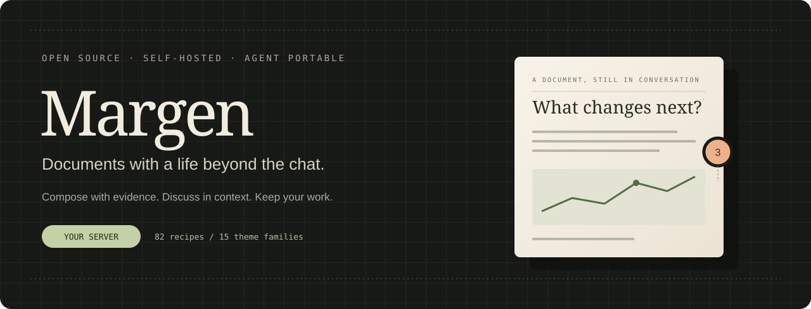
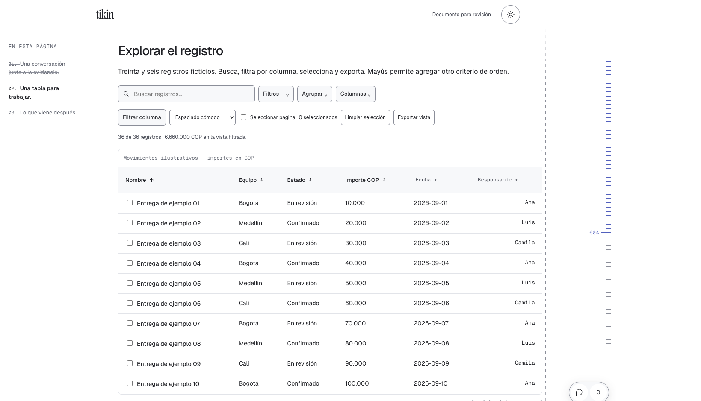
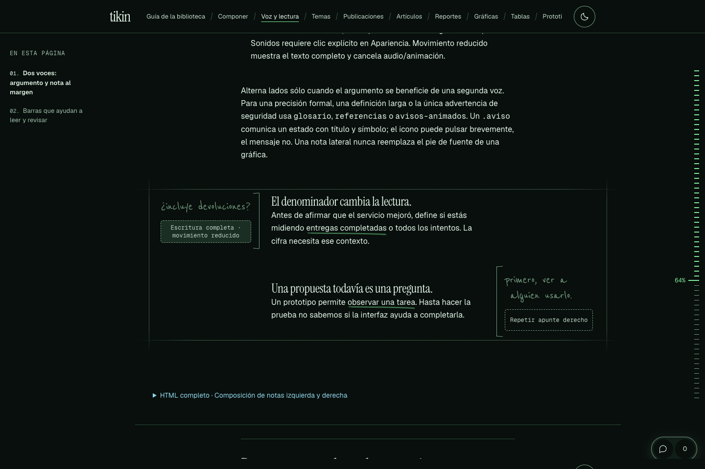
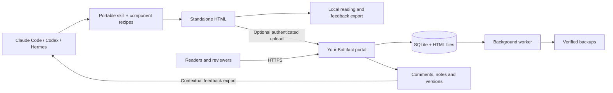

<div align="center">



**Create with your agent. Read, discuss and keep it on your own terms.**

[](https://github.com/angelbotto/bottifact/actions/workflows/validar.yml)
[](LICENSE)
[](https://github.com/angelbotto/bottifact/releases/latest)
[](https://github.com/angelbotto/bottifact/stargazers)

[Get started](#get-started) · [Self-host](self-hosting.md) · [Components](componentes.md) · [Contribute](CONTRIBUTING.md) · [Español](README.es.md)

</div>

Bottifact turns an AI conversation into something worth sharing: an interactive report, an article, a technical explanation or a prototype. It combines an editorial HTML library, a portable agent skill and an optional collaborative portal that you can host yourself.

**Your documents are HTML. Your server stores the files. Your account belongs to your instance.** You do not need a botto.is account, Cloudflare or a managed database to use Bottifact.

### A library for thinking, not just formatting

| Compose | Explore | Review | Keep |
| --- | --- | --- | --- |
| Articles, executive memos, decks and documentation | Interactive tables, charts, maps and globes | Floating comments, threads and private notes | Searchable library with gallery, list, table and relationship map |
| Handwritten margin notes, animated highlights and timelines | Code blocks, terminals and responsive prototype viewers | Export feedback with its quote, section and document version | Tags, collections, immutable versions and source metadata |
| 82 component recipes | 15 theme families × light / dark, plus system mode | Local review, or connected accounts and permissions | One skill directory for Claude Code, Codex and Hermes |

Counts come from [VERSION.json](VERSION.json) and [registro.json](registro.json). The UI and most authoring documentation currently use Spanish; document content can use your language.

<details>
<summary><strong>See the components: interactive data and notes in the margins</strong></summary>

The captures below show library examples with illustrative data. They are component previews, not a hosted account or a guarantee of a particular generated layout.





</details>

## Get started

Choose the part you need. They work independently.

| I want to… | Start here |
| --- | --- |
| Create artifacts with an agent, without a server | Install the skill below |
| Browse the whole component library locally | Clone, then open `guia.html` in a browser |
| Share documents and collect comments on my own domain | [Self-hosting guide](self-hosting.md) |
| Use the existing optional hosted instance | [artifacts.botto.is](https://artifacts.botto.is) — separate account and access policy |

### Install the skill, independently

Requires Python **3.10+**. Generation uses the standard library; Docker and Node are not needed to create documents.

```bash
git clone https://github.com/angelbotto/bottifact.git
cd bottifact
python3 scripts/empaquetar.py
python3 scripts/actualizar.py --paquete descargas/bottifact-portable.zip
```

This verifies the package, installs it in `~/.local/share/bottifact/library`, links it to `~/.agents/skills`, `~/.claude/skills` and `~/.hermes/skills`, and adds `~/.local/bin/bottifact`. Existing skill directories and unrelated launchers are preserved; upgrades keep a backup. Add `~/.local/bin` to your PATH if necessary.

The ZIP and checksum are also available in [Releases](https://github.com/angelbotto/bottifact/releases). A local installation does not register an account, upload files or contact botto.is. To update it, pull a newer release, rebuild the package and repeat the last command. Open a new agent conversation after installation.

> **Try this:** “Use the bottifact skill to turn these notes into a report for my team. Lead with the decision, distinguish evidence from assumptions, and choose components that make the data easier to understand. Keep it local.”

Other tools can read the same [SKILL.md](SKILL.md) and run its scripts. ChatGPT import depends on the skill/file capabilities available in your account; the terminal installer does not install into ChatGPT's cloud service. See [installation details](instalacion.md).

### Create your first artifact

From the repository:

```bash
python3 scripts/crear_artefacto.py \
  --contenido ejemplos/colaborativo-contenido.html \
  --titulo 'Team review' --documento-id team-review \
  --tema linear --modo light --estilo sobrio \
  --salida /tmp/team-review.html
python3 scripts/validar_artefacto.py /tmp/team-review.html
```

Open `/tmp/team-review.html`. Keep `--documento-id` stable when revising that document. Themes, reading progress, floating review controls and motion preferences come from the shared base rather than being reinvented by each agent. Most assets are embedded; the optional Three.js globe loads a pinned CDN dependency and has a text alternative.

### Host your own portal

Requires Docker Engine/Desktop with Compose v2, a domain pointed at your server and ports 80/443 available for the optional Caddy proxy. A Linux server, VM or NAS can run it.

```bash
python3 scripts/configurar_portal.py \
  --origin https://artifacts.example.com --admin you@example.com

docker compose -f compose.yaml -f deploy/https.yaml up -d --build

docker compose exec app python -m portal.manage bootstrap --email you@example.com
```

Replace the example domain and email. The setup command writes a private `.env` with a random secret and refuses to overwrite existing configuration. The final command prints a short-lived, one-use administrator login link; treat it as a password. Configure Google OIDC or email codes for normal sign-in. **No identity provider is mandatory for the first administrator bootstrap.**

The app and worker use named volumes. The proxy obtains and renews HTTPS certificates. If you already have a proxy, use `docker compose up -d --build` and forward HTTPS to `127.0.0.1:8788`.

**[Full setup →](self-hosting.md)** — environment variables, Google, email, backups, upgrades, restore and troubleshooting.

## How the pieces fit



The portal is **FastAPI + SQLite + vanilla JavaScript**. The generator is Python, the reader is HTML/CSS/JavaScript, and deployment uses two application processes plus an optional reverse proxy. There is no required LLM API, vector database, Node server or paid storage service.

| Capability | Standalone HTML | Self-hosted portal |
| --- | --- | --- |
| Reading, themes, charts and interactions | Yes | Yes |
| Comments and notes | Browser-local storage and export | Central storage with identity and document permissions |
| Sharing | Send or host the file | Public, unlisted or restricted by account/email |
| Search and organization | Individual document | Titles/content, tags, collections and relationship map |
| Versions and backups | Keep your own files | Draft/published versions, hashes and verified backups |
| Agent/session/device context | Supplied during creation | Recorded on publication and included in feedback exports |

**Important boundaries:** the graph currently connects shared tags and collections; it does not infer causality or read your conversations. Session references are metadata, not automatic transcript synchronization. There is no MCP server, model training or live multiplayer text editor in this release. Globes and vehicle examples use illustrative data unless you supply a real source. Audio waits for a browser interaction and respects user preferences.

## Make it yours

- **Themes:** choose color family independently from light/dark/system and typography. See [themes](temas.md).
- **Components:** discover recipes with `python3 scripts/catalogo.py`, then retrieve one with `--id`. See [component reference](componentes.md) and [composition guide](guia-uso.md).
- **Writing:** evidence, highlights/lowlights and decisions by default; adapt voice to the author and audience. See [editorial profile](voz-ejecutiva.md).
- **Feedback:** export comments with document identity, version, quoted passage and source context. See [connected library](biblioteca-conectada.md).
- **Hosting:** your domain, your Google project/email provider, your storage and administrator accounts. See [configuration](self-hosting.md).

## Build together

Contributions are welcome: a focused bug fix, a useful recipe, accessibility improvements, translations, tests or a better deployment guide. Start with [CONTRIBUTING.md](CONTRIBUTING.md), the [roadmap](ROADMAP.md) and [open issues](https://github.com/angelbotto/bottifact/issues). Propose larger changes before implementing them.

[Security policy](SECURITY.md) · [Code of conduct](CODE_OF_CONDUCT.md) · [Changelog](CHANGELOG.md) · [Architecture](arquitectura.md)

### Star history

If Bottifact is useful, a star helps other people discover it. The linked graph uses the repository's actual public star history. A new project starts without a history; we do not add sample stars or a fabricated growth curve.

[Explore the live star-history graph →](https://star-history.com/#angelbotto/bottifact&Date)

## License and credits

Original Bottifact code and documentation: **[MIT](LICENSE)**. Bundled fonts, reference audio, geographic data and third-party code keep their own notices; see [NOTICE](NOTICE). Company logos and names are not licensed as Bottifact branding. Editor-inspired palettes are independent adaptations, not official products or endorsements.

Created by [Ángel Botto](https://github.com/angelbotto). Editorial interaction references include [cmrg.me](https://www.cmrg.me/); source attribution is preserved in the library.
