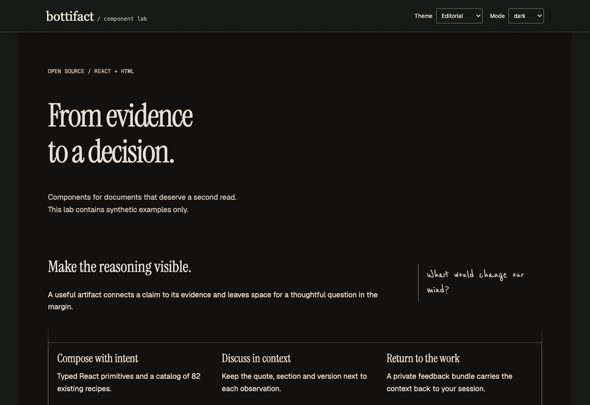

<div align="center">

# Bottifact

**Turn evidence into an artifact people can read, explore and improve.**

An open-source component library, portable agent skill and optional self-hosted review workspace.

[](https://github.com/angelbotto/bottifact/actions/workflows/validate.yml)
[](https://github.com/angelbotto/bottifact/actions/workflows/selfhost.yml)
[](LICENSE)
[](https://github.com/angelbotto/bottifact/stargazers)

[Install](#install-the-agent-skill) · [Self-host](#host-your-own-workspace) · [React](#use-components-in-react) · [Documentation](docs/README.md) · [Español](README.es.md)

</div>



*This screenshot comes from the synthetic local demo. No customer documents, accounts, comments or session identifiers are shown.*

Bottifact brings together **82 interactive recipes**, **15 theme families with light/dark/system modes**, a shared skill for **Claude Code, Codex and Hermes**, and a portal you can run on your own server. Generate standalone HTML without an account. Add the portal when you need shared comments, private notes, permissions, versions and a searchable library.

## Choose your starting point

| I want to… | Start here | Requirements |
| --- | --- | --- |
| Make artifacts with my agent | Install the skill below | Python 3.10+, modern browser |
| Use components in a React app | [React SDK](docs/react.md) | Node 22.12+, React 18.3 or 19 |
| Host my own library and review workspace | [Self-hosting](docs/self-hosting.md) | Docker + Compose v2, persistent disk; HTTPS for remote use |
| Add or improve a component | [Component contribution guide](docs/contributing-components.md) | Python; Node only for the React layer |
| Understand the implementation | [Architecture](docs/architecture.md) | No installation needed |

## Install the agent skill

The independent installation needs **no account, token or environment variables**:

```bash
git clone https://github.com/angelbotto/bottifact.git
cd bottifact
python3 scripts/package.py
python3 scripts/update.py --package dist/bottifact-portable.zip
```

This installs one shared library in `~/.local/share/bottifact/library`, links it into `~/.agents/skills`, `~/.claude/skills` and `~/.hermes/skills`, and creates `~/.local/bin/bottifact`. Existing independent skill directories are preserved. Add `~/.local/bin` to your `PATH` if necessary. Restart or reload your agent's skill discovery and ask it to use **Bottifact**. Agent versions control how skills are discovered; this is not an installer for the ChatGPT website.

To install from your own portal instead:

```bash
curl -fsSL https://artifacts.example.com/install.sh -o /tmp/bottifact-install.sh
# Inspect the downloaded script before running it.
bash /tmp/bottifact-install.sh
```

The shell entrypoint uses Python for verified downloads, safe extraction and agent links. Update from the configured portal with `bottifact update`. For an independent ZIP installation, update the checkout, rebuild the ZIP and repeat the local command above. Downloadable ZIPs and SHA-256 checksums are also attached to [GitHub releases](https://github.com/angelbotto/bottifact/releases).

Generate your first artifact from the checkout:

```bash
python3 scripts/create_artifact.py \
  --content examples/content/standard-content.html \
  --title 'Decision brief' --document-id decision-brief \
  --theme linear --mode system --output /tmp/decision-brief.html
python3 scripts/validate_artifact.py /tmp/decision-brief.html
```

Keep the same `--document-id` when revising a document. Generation embeds fonts, styles and needed runtime modules. Three.js visualizations additionally load a pinned CDN dependency. [Installation details and troubleshooting →](docs/installation.md)

## Host your own workspace

Your instance owns its data and users; it does not need a botto.is, Cloudflare or Supabase account. From the cloned repository:

```bash
python3 scripts/configure_portal.py \
  --origin https://artifacts.example.com --admin owner@example.com
# Creates a private .env with a fresh random secret. Configure authentication below.
docker compose -f compose.yaml -f deploy/https.yaml up -d --build
```

Point the domain at the server and make ports 80/443 available for the optional Caddy HTTPS overlay. With an existing reverse proxy, use `docker compose up -d --build` and forward your HTTPS origin to `127.0.0.1:8788`. A fresh workspace starts empty.

### Environment variables

The complete starting file is [`.env.example`](.env.example). The configuration helper fills the first four values. Never commit the resulting `.env`.

| Variable | Required / default | Meaning |
| --- | --- | --- |
| `BOTTIFACT_ORIGIN` | Required | External origin, e.g. `https://artifacts.example.com` |
| `BOTTIFACT_DOMAIN` | Required for Caddy | Domain only, e.g. `artifacts.example.com` |
| `BOTTIFACT_ADMIN_EMAILS` | Required | Comma-separated administrators |
| `BOTTIFACT_AUTH_SECRET` | Required; generated by helper | Random authentication secret; do not use the placeholder |
| `BOTTIFACT_OWNER_ALIASES` | Optional, empty | Emails belonging to **one person**, canonical first; never merge teammates |
| `BOTTIFACT_GOOGLE_ENABLED` | `0` | Set `1` to enable Google sign-in |
| `BOTTIFACT_GOOGLE_ID` / `BOTTIFACT_GOOGLE_SECRET` | Required when Google is enabled | Your OAuth client credentials |
| `BOTTIFACT_EMAIL_PROVIDER` | `usesend` | `usesend` or `resend`; not SMTP |
| `BOTTIFACT_EMAIL_URL` / `BOTTIFACT_EMAIL_FROM` / `BOTTIFACT_EMAIL_KEY` | Required for email codes | Provider URL, verified sender and API key |
| `BOTTIFACT_DATA` / `BOTTIFACT_BACKUPS` / `BOTTIFACT_RELEASES` | `/data` / `/backups` / `/releases` | Container paths; keep these with the supplied Compose file |
| `BOTTIFACT_BIND` / `BOTTIFACT_PORT` | `127.0.0.1` / `8788` | Host HTTP binding behind your proxy |
| `BOTTIFACT_UID` / `BOTTIFACT_GID` | `1000` / `1000` | Container user/group; changing existing volumes needs ownership migration |
| `BOTTIFACT_IMAGE_TAG` | `latest` | Optional local container image tag |

Configure Google with redirect URI `https://artifacts.example.com/auth/google/callback`, email codes, or both. For the first administrator, server access allows a one-time bootstrap:

```bash
docker compose exec app python -m portal.manage bootstrap --email owner@example.com
```

Open the returned single-use link privately. There is no default password. Configure normal authentication before inviting other users. The portal uses FastAPI, SQLite/FTS and a background worker. Run one app instance with a local persistent volume. Backups, provider setup, recovery and upgrades are covered in the [self-hosting runbook](docs/self-hosting.md).

## Publish, review and return feedback to your session

Sign in to your portal, create an agent token under **Conectar un agente**, then connect through the masked prompt:

```bash
bottifact connect --server https://artifacts.example.com
bottifact publish --file /tmp/decision-brief.html --title 'Decision brief' \
  --visibility private --agent codex --session SESSION_ID --device DEVICE_LABEL
```

Supply the actual agent session ID and a device label you are comfortable storing. Publication records artifact identity, version and source context. Tokens remain outside the shared skill.

- **Standalone HTML:** floating comments stay in that browser; export/import them to exchange a review.
- **Connected portal:** authenticated comments, replies, states and private notes are stored centrally, subject to document and note permissions.
- **Feedback export:** includes the artifact link, version/hash, anchored section or quote, discussion and available source session/device. An outdated anchor remains identifiable as outdated.

```bash
bottifact comments --artifact-id ARTIFACT_ID --open --kind all
bottifact feedback --artifact-id ARTIFACT_ID --output /tmp/bottifact-feedback
```

`feedback` creates a private `feedback.md` + `context.json` bundle. Open the original agent session and ask it to read those files. If the origin is missing or ambiguous, supply `--agent` and `--session` explicitly. **This release does not automatically inject messages into Claude, Codex or Hermes, edit conversation histories, or execute instructions from comments.** Review changes, publish a new version, then resolve the relevant threads. [Complete feedback/session workflow →](docs/feedback-and-sessions.md)

## Search and graph connections

The portal offers a searchable library with list/gallery/table views, previews, tags, collections and a relationship graph. Search indexes document text as well as titles. Local classification rules suggest categories and tags and expose the matched terms. Graph edges explain shared tags or collections; they are computed only from documents the requester may access.

This is an explainable local graph, not embedding search or automatic knowledge of your chat history. It does not upload conversations or train a model. [Graph model, limits and extension points →](docs/graphs.md)

## Use components in React

The source workspace includes `@bottifact/core` and `@bottifact/react`. These package names are **not yet published to npm**. Run the working showcase:

```bash
npm ci
npm run build
npm run dev
```

```tsx
import { Artifact, Callout, MarginNote, RecipePreview } from '@bottifact/react';
import '@bottifact/react/styles.css';

export function Brief() {
  return (
    <Artifact theme="linear" mode="system">
      <h1>A decision with its evidence</h1>
      <MarginNote side="right" note="Check the denominator.">
        <p>Write the finding, source and limitation here.</p>
      </MarginNote>
      <Callout title="Decision needed">Define the next experiment.</Callout>
      <RecipePreview id="bar-chart" theme="linear" mode="dark" />
    </Artifact>
  );
}
```

There are **8 native React exports**: `Artifact`, `Callout`, `MarginNote`, `Timeline`, `CardGrid`, `DataTable`, `ArtifactFrame` and `RecipePreview`. The last provides access to **all 82 existing recipes inside sandboxed frames**. This is not a claim that all 82 have been rewritten as native React components. Full shared review and publication remain portal capabilities. [Using packed packages in another app, API and limitations →](docs/react.md)

## Repository map

```text
packages/
  core/
    components/       Framework-independent interaction modules
    recipes/          One directory per component: HTML, guidance, manifest
    themes/families/   One file per theme family
    brands/           Brand configuration
    styles/           Editorial styles and embedded fonts
    registry/         Generated catalog, compatibility and aliases
    src/              Typed core API and generated data
  react/src/          Native React components and scoped styles
portal/               Authentication, storage, review, search, graph, worker
examples/
  content/            Editable document content
  generated/          Complete generated HTML artifacts
  react/              Synthetic interactive React showcase
scripts/              Build, validation, installation, publishing, scaffolding
agents/               Agent integration metadata
licenses/             Third-party licenses and provenance
docs/                 Architecture, guides, operations and migration notes
tests/evidence/       Dated verification records; not current guarantees
```

[Architecture and boundaries](docs/architecture.md) · [Migration from v0.1](docs/migration-0.2.md) · [Source vs generated files](docs/contributing-components.md)

## Contribute

Improve a recipe in `packages/core/recipes/<id>/`, or scaffold one:

```bash
python3 scripts/new_component.py --id release-brief \
  --title 'Release brief' --category reports
python3 scripts/build.py
python3 scripts/validate.py
npm run check
```

Read [CONTRIBUTING.md](CONTRIBUTING.md) for the complete checks, contribution boundaries and review criteria. We welcome accessibility fixes, clearer examples, theme improvements and native React ports. Public screenshots must come from synthetic fixtures; see [screenshot policy](docs/screenshots.md).

## Status and boundaries

Bottifact is an early-stage project. The standalone generator, portal, skill and React layer have different runtime requirements. There is no npm release yet, multi-replica database support, automatic chat injection or semantic graph model. [Roadmap](ROADMAP.md) tracks future work; [changelog](CHANGELOG.md) records shipped changes.

MIT for project code. Fonts, approved reference sounds and geographic inputs retain their own terms in [NOTICE](NOTICE) and [licenses/](licenses). Brand names and logos do not imply endorsement or grant trademark rights. The editorial reference is credited in [design documentation](docs/editorial-reference.md).

Please report vulnerabilities privately through [SECURITY.md](SECURITY.md). Community participation follows the [Code of Conduct](CODE_OF_CONDUCT.md).
