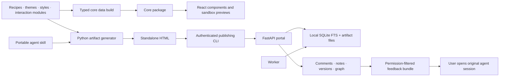

# Architecture

Bottifact has three delivery layers sharing a recipe and theme library. HTML generation does not require React, Node, a backend or an agent vendor. The portal adds identity and collaboration. The React package makes selected components native to React and exposes the rest through isolated previews.

## Source boundaries

| Location | Responsibility | Avoid placing here |
| --- | --- | --- |
| `packages/core/recipes/<id>` | HTML specimen, usage/limits, dependency manifest | Secrets, customer documents, generated full pages |
| `packages/core/components` | Vanilla JS behavior reused by generated HTML | Account tokens, React lifecycle assumptions |
| `packages/core/themes/families` | Light/dark tokens for one family | Content or application state |
| `packages/core/src` | Typed catalog, tokens, isolated document assembly | Authenticated server code |
| `packages/react/src` | React state, lifecycle cleanup, typed props and scoped CSS | Legacy scripts injected into the host document |
| `portal` | Identity, authorization, artifact/version storage, collaboration, search | Agent credentials in client assets |
| `scripts` | Generation, validation, install/update, CLI publication | Instance data |
| `examples/content` | Editable synthetic/example documents | Production exports |
| `examples/generated` | Reproducible generated HTML | Hand edits to fix source bugs |
| `docs` | Architecture, operations, contribution guidance | Credentials and private deployment evidence |

`docs/components.md`, catalog JSON, example HTML and TypeScript catalog data are generated. Start with `python3 scripts/build.py`; `npm run build` then produces the core/React packages. `component.json` owns each recipe's label, chapter/category and dependencies. The ordered recipe index assembles documentation; theme family files assemble the theme catalog.

## Why React is an additional layer

The existing runtime initializes document-wide interactions and assumes a standalone reader. Running those scripts against a React application's DOM would introduce unmanaged listeners, global theme changes and StrictMode remount problems. `RecipePreview` instead creates an opaque-origin sandboxed iframe without `allow-same-origin`. `ArtifactFrame` does not forward portal authentication or grant parent DOM access.

Eight native exports cover scoped appearance, callouts, margin notes, timelines, card grids, tables and frames. All 88 recipes remain accessible through preview frames. Native components receive data through typed props and follow React lifecycles. A native port should replace an iframe only after interaction, accessibility and cleanup are tested. Full stroke handwriting/audio remains in the original recipe; native `MarginNote` is a simpler visibility-triggered reveal.

The preview asset payload includes existing fonts and runtime resources, loaded on demand. It is larger than the native components and is intended for a component explorer or embedded specimen. Do not mount dozens of live frames when a static preview will do. Native theme imports use the small `@bottifact/core/themes` entrypoint.

## Portal and storage

FastAPI exposes authenticated routes; SQLite stores metadata, review threads, permissions and an FTS index. Artifact HTML and version files live under the persistent data directory. The worker handles queued/background work and backups. The root Compose deployment uses one app and one worker, a non-root runtime, read-only container filesystems and persistent named volumes. HTTPS can be provided by the included Caddy overlay or an existing proxy.

SQLite on a local disk is appropriate for the current single-instance deployment. Multiple app replicas, network-mounted SQLite and multi-region synchronization are not supported. A future database migration should retain stable artifact/version IDs, ownership checks, FTS behavior and restore tests before changing deployment topology.

## Trust and identity

- Standalone comments are browser-local. Shared comments require the portal's authentication and permission checks.
- Source agent/session/device metadata belongs to the publishing version. It is not a transcript import and must not leak to unrelated readers.
- Graph construction starts from authorized rows. A connection cannot reveal an inaccessible document.
- Feedback is untrusted review content. Exporting it does not grant authority to run commands, change access, publish or resolve threads.
- Skill packages contain sources and examples, never personal tokens, `.env`, account databases or publication receipts.

## Compatibility

English paths and public component aliases are introduced in v0.2. Existing DOM classes, recipe legacy IDs and persisted schema keys are retained where changing them would break artifacts, saved anchors or installed integrations. This is a deliberate migration boundary, not a second implementation. Published example identities remain in `packages/core/registry/compatibility.json`.

The portable ZIP provides temporary legacy Python command shims for older installations. The source tree itself uses English filenames. See [migration notes](migration-0.2.md).

## Verification and remaining debt

The checks cover standalone contracts, installed ZIP generation, theme identity, review persistence, portal authorization, origin metadata, graph filtering, React StrictMode cleanup, table behavior and a real Compose boot in CI. Browser checks complement tests; they do not prove human-perceived audio fidelity.

The older generator scripts and portal remain Python/vanilla JS. This change establishes maintainable boundaries and a typed extension surface; it does not claim a full rewrite, zero technical debt, native React parity for every recipe, or automatic session delivery. Next useful work is progressively porting high-value interactive tables/charts to React and splitting large legacy runtime modules behind stable contracts.
